# NLW3
 
Aplicação feita durante o evento Next Level Week 3 da Rocketseat 12/10/2020 - 16/10/2020. Happy é um projeto para pessoas agendarem visitas a orfanatos por meio de aplicativos web e mobile.

 
Em ambas aplicações, os usuários podem cadastrar informações de orfanatos para visita como nome, localização, intruções, atendimento em fim de semana, fotos e horário de atendimento. Também é possível acessar os detalhes de orfanatos cadastrados no mapa.

# Web

  
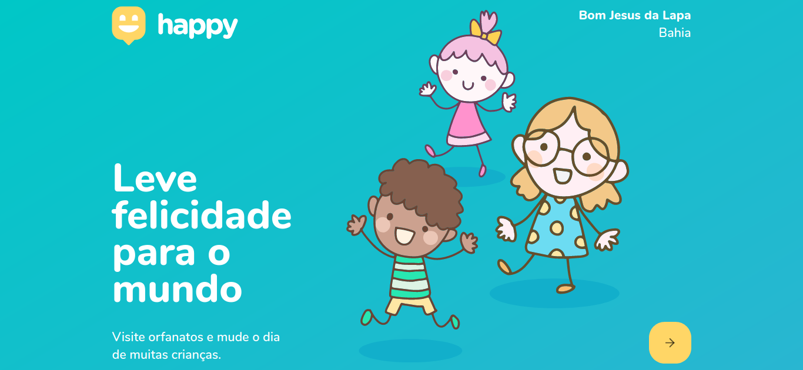

  
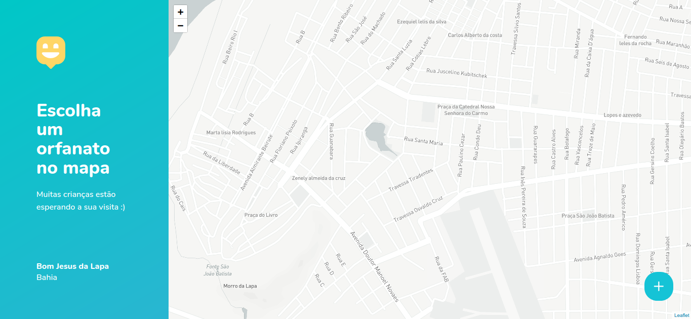

  
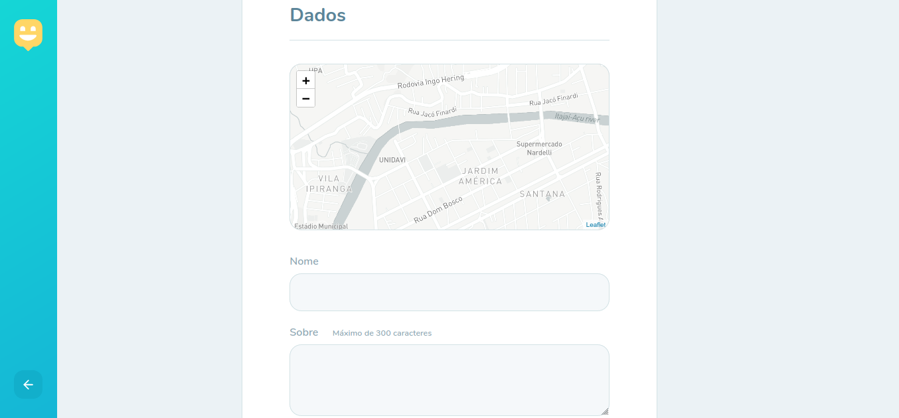

  
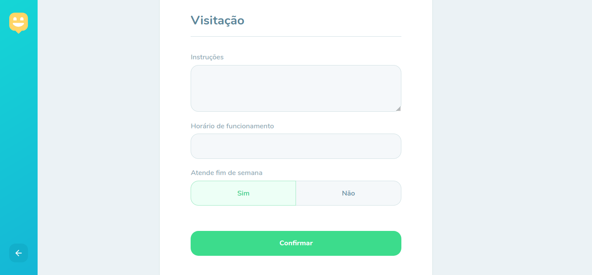

  
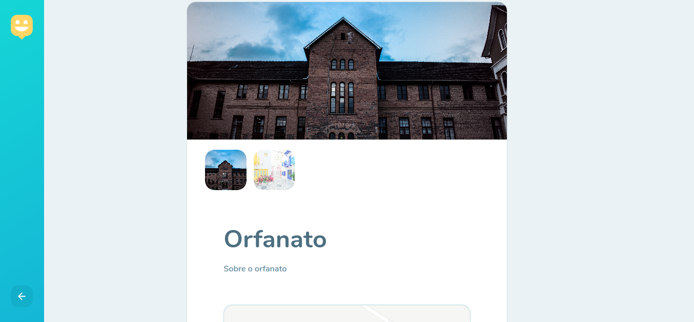

  
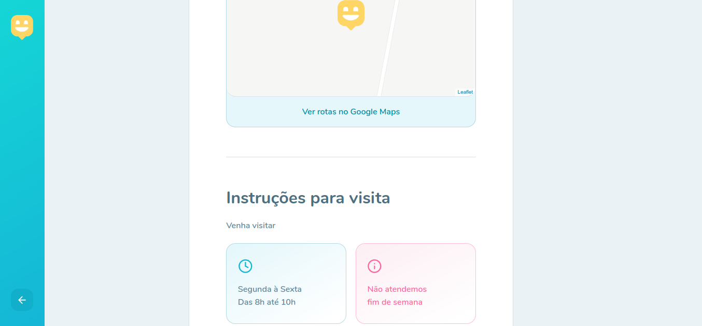

# Mobile

  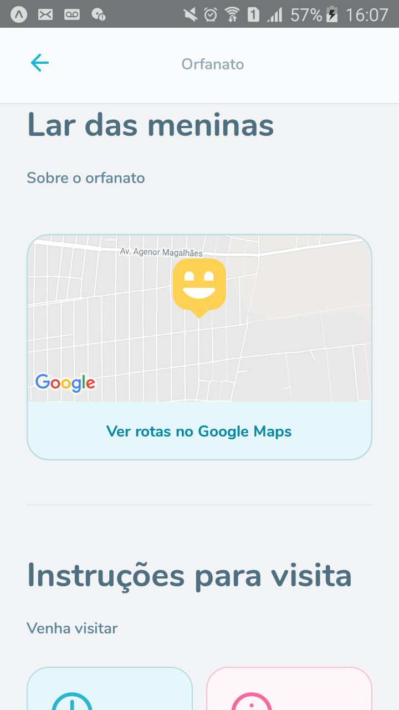
  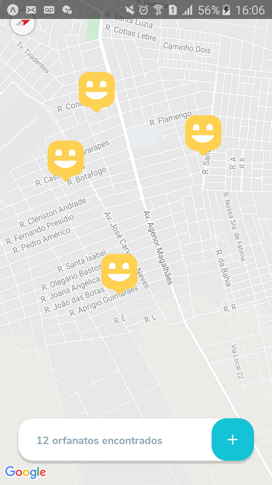
  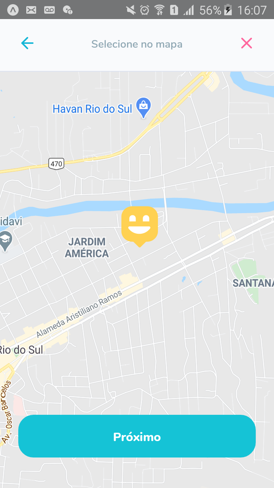

  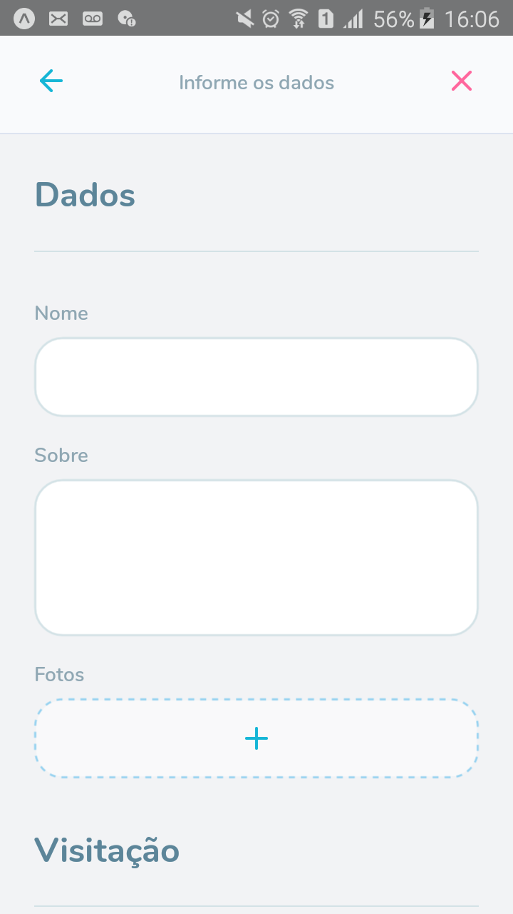
  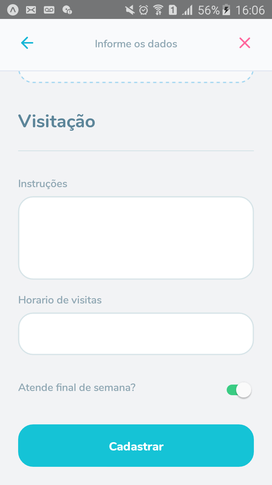

# Funcionalidades
## Web e Mobile
 - Cadastro e listagem de orfanatos.

# Principais Tecnologias
 - Node.js
 - ReactJS
 - React Native
 - Expo
 - SQLite 
 - Yup
 - Cors
 - ORM (Object-Relational Mapping)